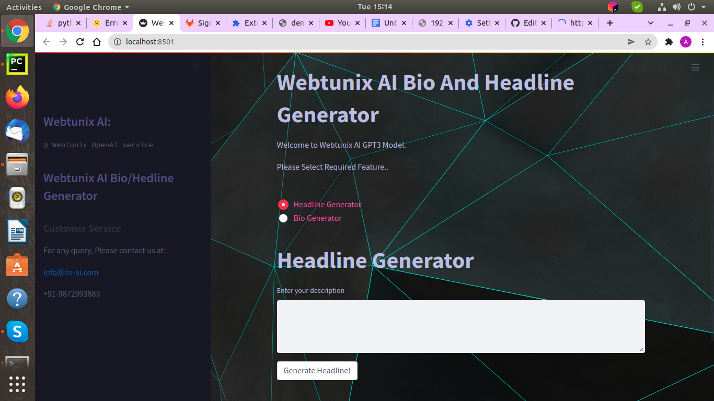
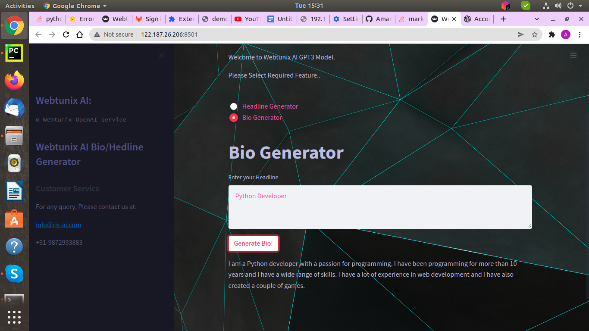

# GPT3_build_An_Autogenerated_textAndDiscription_System
This system help to generate bio and headline for any social media profile.

#### To run this project
Clone this repo.
Create a virtual environment

Need some library to install:
You have to install OPENAI library to 

% pip3 install openai

Install streamlit for API (more about streamlit: https://streamlit.io/)

% pip3 install streamlit

Run the .py file

% streamlit run Webtunix_Post_Generator.py

Make change according you in css file for your template.

